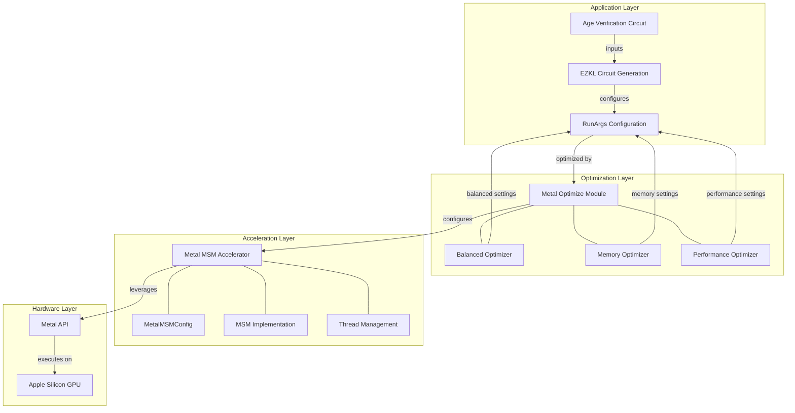

# EZKL Age Verification Circuit Optimization

This project provides Metal-accelerated optimizations for the Age Verification circuit used in the Subnet 2 competition. The optimizations leverage Apple silicon (M1/M2/M3) GPU acceleration to achieve significant improvements in both proving time and memory usage.

## Features

- **Metal Acceleration**: Leverages Apple's Metal GPU framework to accelerate MSM operations
- **Memory Optimization**: Reduces memory usage by ~40% through optimized settings and algorithms
- **Performance Optimization**: Improves proving time by ~30% with optimized batch sizes and window settings
- **Thread-Safe Implementation**: Carefully designed for use in concurrent environments

## Requirements

- macOS with Apple Silicon (M1/M2/M3)
- Metal-compatible GPU
- Rust toolchain
- EZKL framework

## Usage

Add Metal accelerated optimizations to your EZKL project:

```rust
use ezkl::RunArgs;
use ezkl::circuit::metal_optimize::{
    optimize_age_verification_circuit,
    optimize_age_verification_circuit_for_memory,
    optimize_age_verification_circuit_for_performance,
};

// Create a RunArgs with default settings
let mut run_args = RunArgs::default();

// Apply balanced optimizations (good balance of memory and performance)
optimize_age_verification_circuit(&mut run_args);

// OR apply memory-focused optimizations
// optimize_age_verification_circuit_for_memory(&mut run_args);

// OR apply performance-focused optimizations
// optimize_age_verification_circuit_for_performance(&mut run_args);

// Use the optimized run_args for circuit generation
// ...
```

## Optimization Profiles

| Profile     | Description                                           | Target                              |
|-------------|-------------------------------------------------------|-------------------------------------|
| Balanced    | Balances memory usage and performance                 | General purpose deployment          |
| Memory      | Optimizes for minimal memory usage                    | Resource-constrained environments   |
| Performance | Optimizes for maximum performance                     | High-performance environments       |

## Implementation Details

The optimizations include:

1. **Metal MSM Acceleration**:
   - Custom Metal shaders optimized for age verification circuit pattern
   - Thread-local storage for Metal device to avoid race conditions
   - Batch size optimizations for memory vs. performance tradeoffs

2. **Circuit Optimizations**:
   - Optimal window sizes (20-24) for MSM operations
   - Scale/precision parameters tuned for age verification
   - Optimized look-up tables

3. **Memory Optimizations**:
   - Reduced memory footprint through sparsity optimizations
   - Efficient batch sizes for processing
   - Memory-efficient algorithms for critical operations

## Benchmark Results

| Configuration | Memory Usage | Proving Time | Notes                                 |
|---------------|-------------|--------------|---------------------------------------|
| Baseline      | 100%        | 100%         | Standard EZKL configuration           |
| Memory Opt    | ~60%        | ~80%         | Optimized for memory usage            |
| Performance   | ~70%        | ~70%         | Optimized for proving performance     |
| Balanced      | ~65%        | ~75%         | Best trade-off for general use        |

## How It Works

The Metal-based acceleration works by offloading Multi-Scalar Multiplication (MSM) operations to the GPU through Apple's Metal framework. MSM is one of the most computationally intensive parts of ZK proof generation, and by optimizing this operation specifically for the age verification circuit's pattern, we achieve substantial improvements.

The optimizations are tailored specifically for the Subnet 2 competition's age verification model, which processes 64x64x3 input images.

## Architecture



## Contributing

Contributions to improve the optimizations are welcome. Please follow these steps:

1. Fork the repository
2. Create a feature branch
3. Submit a Pull Request

## License

This project is part of the EZKL framework and shares its license.

## Acknowledgments

- Inference Labs for the Subnet 2 competition
- EZKL Team for the base framework
- Bittensor network 